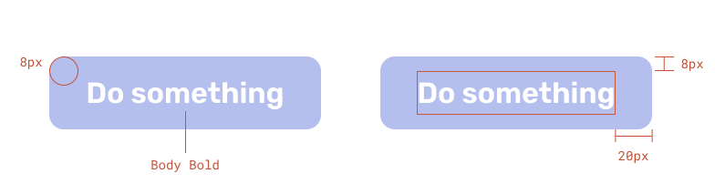

import { InlineSwatch } from "@site/src/components";
import { colors } from "sfgov-design-system/src/tokens";
import DoDont, { Do, Dont } from '@site/src/components/DoDont'

Use buttons for major actions.

Buttons draw more attention than a simple text link. Because of their larger surface and color, they are visually more findable and easier to click or tap.

## When to use

Use a button when an action has more weight or significance. Examples:

* There is a clear primary action people should take
* Highlighting a suggested action in a page section
* A significant or destructive action will be applied and users need to be aware

If the action should not be prompted, a text link may be a better option.

## Types of buttons

### Primary button

This is the most common type of button. Use these to direct people to a clear primary action. To call out that these buttons are actionable, they are  <InlineSwatch value={colors.action} label='action blue' />.

```html
<button class="btn">
  Do something
</button>
```

Try not to have more than 1 primary button on a page. Multiple primary buttons puts more cognitive load on people. It takes them more time and effort to figure out what to do.

### Inverse button

On some backgrounds, the primary button color will not have sufficient contrast. In this case, use inverse buttons, which have a white fill.

```html live class="bg-blue-dark"
<div class="bg-blue-dark">
  <button class="btn btn-inverse">
    Do something
  </button>
</div>
```

### Secondary button

```html live
<button class="btn btn-secondary">
  Do something
</button>
```

Secondary buttons don’t have as much visual weight because they are outlined instead of solid. Use these if your button is not an important action on the page.

Pair it side-by-side with a primary button to prompt toward the primary button’s action.

```html live
<div class="flex gap-20">
  <button class="btn btn-secondary">
    Cancel
  </button>
  <button class="btn">
    Continue
  </button>
</div>
```

## Variations

### Block buttons

Block buttons stretch to fill the width of the screen or area instead of having a set width. They are often used on mobile layouts.

```html live
<div class="bg-blue-1 p-20 text-slate text-body">
  <div>COVID-19 vaccination appointments available only for San Francisco Health Network patients.</div>
  <button class="btn btn-block my-20">
    Check for availability
  </button>
  <div class="text-center">
    Or call <a href="tel:1234567890" class="text-action">123-456-7890</a>
  </div>
</div>
```

### Icons

Icons can be on the left or right of the text in a button. Do not use more than one icon in a button.

```html live
<div class="flex justify-around items-center gap-16 title-xs">
  <a href="#" class="btn btn-secondary flex gap-8">
    <sfgov-icon symbol="arrow-left"></sfgov-icon>
    <span>Previous</span>
  </a>
  <a href="#" class="text-action">1</a>
  <span>...</span>
  <a href="#" class="text-action">8</a>
  <a href="#" class="text-action">9</a>
  <span>10</span>
  <a href="#" class="text-action">11</a>
  <a href="#" class="btn btn-secondary flex gap-8">
    <span>Next</span>
    <sfgov-icon symbol="arrow-right"></sfgov-icon>
  </a>
</div>
```

Icons should reinforce the meaning of the button’s text. In rare cases, an icon can be used without text. Only do this if the icon is extremely universally understood, such as an arrow or search magnifying glass. [Read more about icons](/design/icons/)

## Appearance



Buttons have:
* corner radius of 8px
* 8px padding on the top and bottom
* 20px padding left and right, but can be variable on block buttons
* Body Bold text

## Usage

### Alignment

Buttons are typically left aligned with other content, not centered. For exceptions, see <a href="#block-buttons">block buttons</a>.

<DoDont>
  <Do reasons={["Button is left aligned with other content"]}>
    <div class="bg-blue-1 p-20 space-y-16">
      <h3 class="text-title-lg">Be a DreamSF Fellow</h3>
      <p>The DreamSF Fellowship is a paid leadership and civic engagement program for immigrant youth.</p>
      <div>
        <button class="btn">Apply now</button>
      </div>
    </div>
  </Do>
  <Dont reasons={["Button is centered"]}>
    <div class="bg-blue-1 p-20 space-y-16">
      <h3 class="text-title-lg">Be a DreamSF Fellow</h3>
      <p>The DreamSF Fellowship is a paid leadership and civic engagement program for immigrant youth.</p>
      <div class="text-center">
        <button class="btn">Apply now</button>
      </div>
    </div>
  </Dont>
</DoDont>

### Arrangement of multiple buttons

For 2 or more button options, place them side by side instead of on top of one another if possible. This reduces the chance of accidentally clicking the wrong one and avoids alignment issues.

<DoDont>
  <Do reasons={["Choices are side by side"]}>
    <div class="flex gap-20 p-20">
      <button class="btn btn-secondary">Cancel</button>
      <button class="btn">Continue</button>
    </div>
  </Do>
  <Dont reasons={["Choices are stacked"]}>
    <div class="p-20">
      <button class="btn btn-secondary mb-20">Cancel</button>
      <br />
      <button class="btn">Continue</button>
    </div>
  </Dont>
</DoDont>

### Writing button text

Button text should ideally be less than 15 characters. A maximum of 25 characters is OK if necessary.

Refer to the [button text library](https://sfgovdt.jira.com/wiki/spaces/SFGOV/pages/3221651460/Button+text+library) for common button uses.

Long button text is less legible, less impactful, and sometimes can even cause wrapping.

<DoDont>
  <Do reasons={['Button text is short']}>
    <div className='p-20'>
      <button class="btn">Apply now</button>
    </div>
  </Do>
  <Dont reasons={['Button text is very long']}>
    <div className='p-20'>
      <button class="btn">Apply now for your Small Business Grant</button>
    </div>
  </Dont>
</DoDont>

<DoDont>
  <Do reasons={['Button text fits on one line']}>
    <div className='p-20'>
      <button class="btn">Apply now</button>
    </div>
  </Do>
  <Dont reasons={['Button text wraps to fit']}>
    <div className='p-20'>
      <button class="btn">Apply now for your<br />Small Business Grant</button>
    </div>
  </Dont>
</DoDont>

## HTML implementation

Buttons styles can be applied to both HTML links (`<a>` elements) and interactive buttons (`<button>`).

### Link buttons

```html live
<a class="btn" href="#">
  This is a link
</a>
```

### Block link

```html live
<a class="btn btn-block" href="#">
  This is a block link
</a>
```

### HTML buttons

```html live
<button class="btn">
  This is a button
</button>
```

### Block button

```html live
<button class="btn btn-block">
  This is a block button
</button>
```
